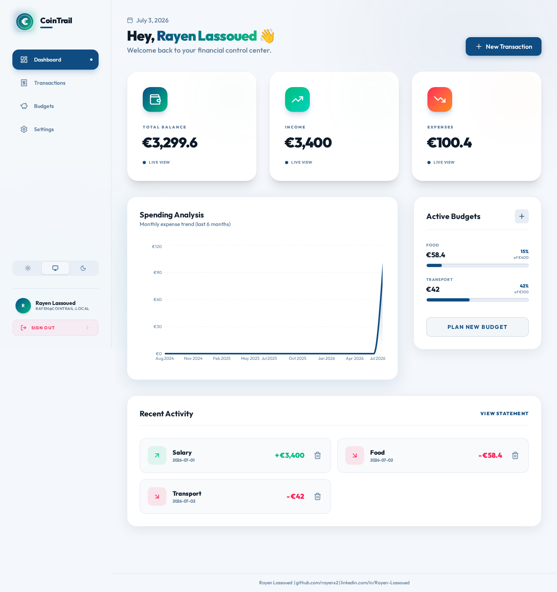
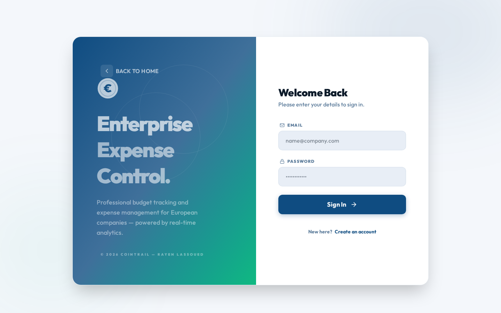
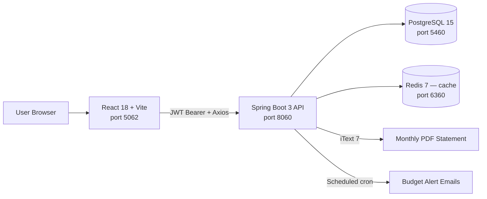
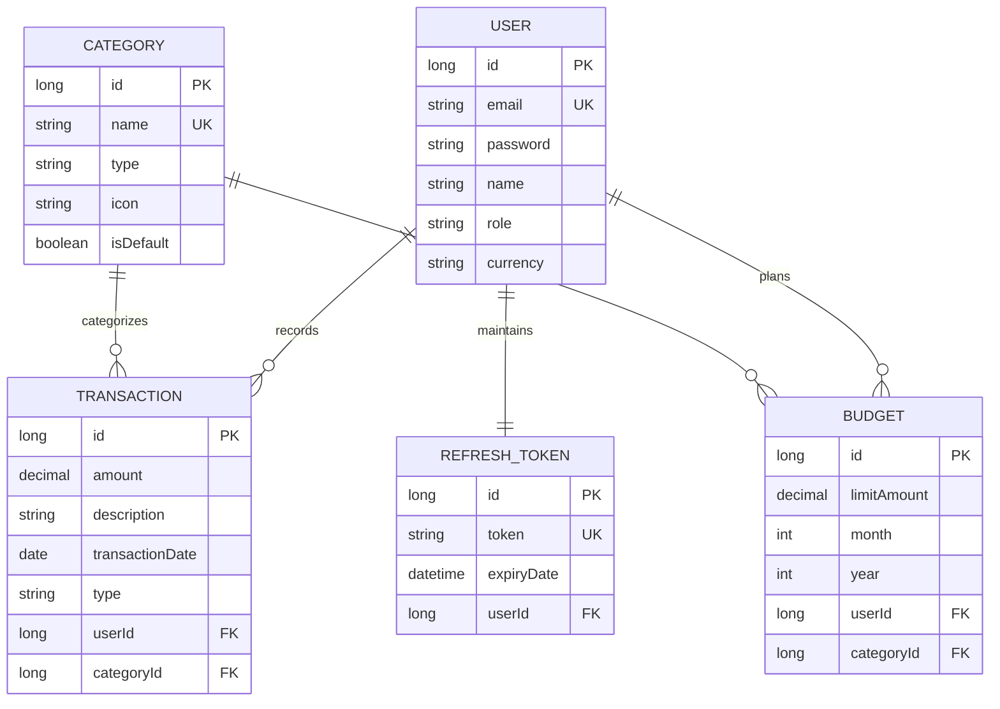

# CoinTrail

<p align="center">
  
  
  
  
  
</p>

<p align="center">
  <strong>Self-hosted expense tracking and budget management</strong><br/>
  Spring Boot 3 API · React 18 dashboard · category budgets with automated alerts · PDF/CSV exports
</p>

<p align="center">
  
</p>

<p align="center">
  
  
</p>

---

## 🚀 Live Demo
Open [`demo/index.html`](demo/index.html) directly in any browser — zero setup, zero
backend required. It shows the dashboard, sample transactions, budgets and the
analytics summary with real pre-computed numbers.

---

## 📋 Overview
CoinTrail is a self-hostable personal/team finance tracker for managing income,
expenses, category-based budgets and monthly PDF/CSV statements. European SMEs, freelancers
and small accounting teams (e.g. Mittelstand companies in Germany, freelance consultancies
in Belgium/Netherlands) get a lightweight alternative to SaaS tools like Lexoffice or
QuickBooks for internal spend tracking — without sending financial data to a third-party cloud.

---

## 🏗️ Architecture



### Database Schema (ER Diagram)



---

## How It Works

1. A request hits the React/Vite frontend on port 5062, which authenticates via `/api/auth/login` and stores a JWT access token + refresh token
2. Every subsequent request carries the JWT in an `Authorization: Bearer` header; on a 401 the Axios interceptor silently exchanges the refresh token for a new access token
3. Transactions and budgets are written straight to PostgreSQL through Spring Data JPA; the analytics endpoint aggregates them into income/expense trends, category breakdowns, and a savings rate in a single query
4. Monthly PDF statements are rendered server-side with iText 7 and cached in Redis per user/date-range, so repeat downloads skip re-querying and re-rendering
5. A Spring `@Scheduled` job runs daily at 09:00, checks every active budget, and emails an alert once spend crosses 90% or the full limit
6. A second daily job (00:05) checks every active recurring-transaction rule and creates the real transaction once its day-of-month arrives, tracking the last generated month so it never double-fires
7. The console renders live KPIs, a monthly spending chart, and budget progress bars — all pulled from the real API, not hardcoded values

---

## 🛠️ Tech Stack

| Technology | Version | Purpose |
|---|---|---|
| Java | 21 | Backend language |
| Spring Boot | 3.4 | REST API, security, scheduling |
| Spring Security + JJWT | 0.12.6 | JWT auth with refresh-token rotation |
| Spring Data JPA / Hibernate | 6.6 | ORM for PostgreSQL |
| PostgreSQL | 15 | Primary relational database |
| Redis | 7 | Caching layer for monthly report generation |
| iText 7 | 7.2.5 | PDF monthly statement generation |
| springdoc-openapi | 2.8.5 | Swagger UI / OpenAPI docs |
| React | 18 | Frontend UI |
| Vite | 8 | Frontend build tool / dev server |
| Tailwind CSS | 4 | Styling (light/dark/system theme) |
| Framer Motion | latest | UI animations |
| Docker Compose | — | Local orchestration of all 4 services |

---

## ⚡ Quick Start

```bash
git clone git@github.com:rayenx2/CoinTrail.git
cd CoinTrail
cp .env.example .env
docker compose up -d --build
```

| Service | URL |
|---------|-----|
| **Frontend UI** | http://localhost:5062 |
| **Backend API** | http://localhost:8060 |
| **Swagger UI** | http://localhost:8060/swagger-ui.html |
| **Health Check** | http://localhost:8060/actuator/health |
| **PostgreSQL** | localhost:5460 |
| **Redis** | localhost:6360 |

> Host ports are remapped to the 5060–8069 range so this project can run alongside other
> portfolio services without port collisions. Frontend is deliberately on **5062**, not
> 5060/5061 — those two are on Chromium's built-in blocked-port list (reserved for SIP)
> and would make the app unreachable in any Chromium-based browser.

---

## ✨ Features

- 🔐 **Secure Auth** — JWT-based authentication (login/register) with refresh-token rotation
- 📊 **Real-time Dashboard** — income, expenses, balance and recent transactions, computed from the analytics endpoint (not just the last page of transactions)
- 🎯 **Smart Budgets** — category-wise monthly limits with visual warnings, create/edit/delete
- 💸 **Transaction Management** — create, delete, search, and paginate transactions
- 🔁 **Recurring Transactions** — set up rent, subscriptions, or salary once with a day-of-month, and a daily job auto-creates the real transaction every month (no manual re-entry, no duplicates)
- 📄 **PDF Exports** — monthly financial statements via `/api/reports/monthly`, cached in Redis
- 📈 **Analytics Summary** — `/api/analytics/summary` returns total income/expense, net balance, savings rate, top expense categories, and a monthly income vs. expense trend
- 📥 **CSV Export** — `/api/export/csv?startDate=&endDate=` exports transactions in a date range to a UTF-8 CSV (BOM-prefixed for Excel, with a running balance column)
- ⏰ **Automated Budget Alerts** — a daily scheduled job emails a warning at 90% spend and another when a budget is exceeded
- 👤 **Profile & Security** — update display name/currency and change password from Settings
- 🩺 **Health & Metrics** — Spring Actuator `/actuator/health` and `/actuator/metrics`
- 🎨 **Light/Dark/System Theme** — full theme support across every page

---

## 📊 Results

- **4 services** (backend, frontend, PostgreSQL, Redis) start with a single `docker compose up -d --build`
- **23 REST endpoints** across auth, transactions, categories, budgets, analytics, reports, exports, and user profile
- **5 entities** modeled with JPA (User, Transaction, Category, Budget, RefreshToken)
- **Analytics endpoint** computes income/expense trends over a configurable window (1–24 months) from raw transaction data in a single query
- **CSV export** returns an RFC 4180-compliant, Excel-compatible file with a running balance column — useful for freelancers importing into accounting tools

---

## 🎯 European Market Use Cases

- **Freelancers & small consultancies** (Germany, Belgium, Netherlands) — track client income vs. operating expenses without a paid SaaS subscription
- **Small accounting teams** — generate monthly PDF statements for clients
- **Personal finance** — budget-conscious users who want full data ownership (self-hosted, no third-party cloud)

---

## 👤 Author

**Rayen Lassoued**
[github.com/rayenx2](https://github.com/rayenx2) |
[LinkedIn](https://linkedin.com/in/Rayen-Lassoued)

## 📄 License

MIT — see [LICENSE](LICENSE)
